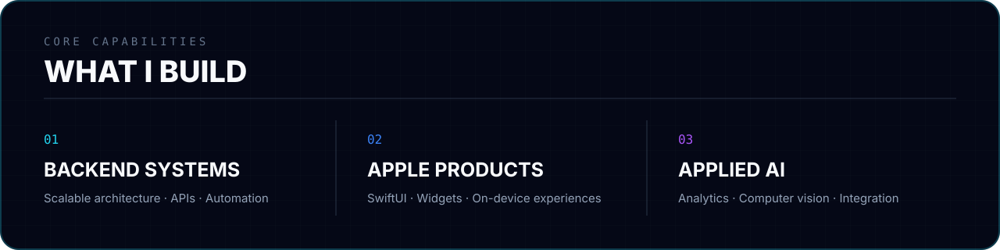
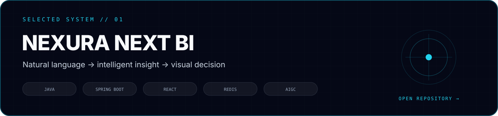
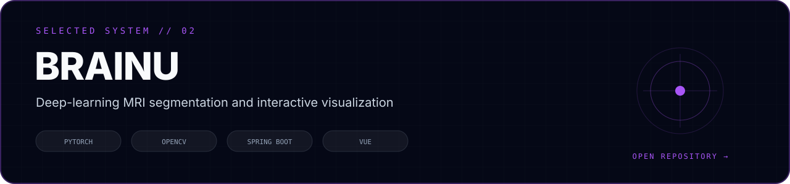
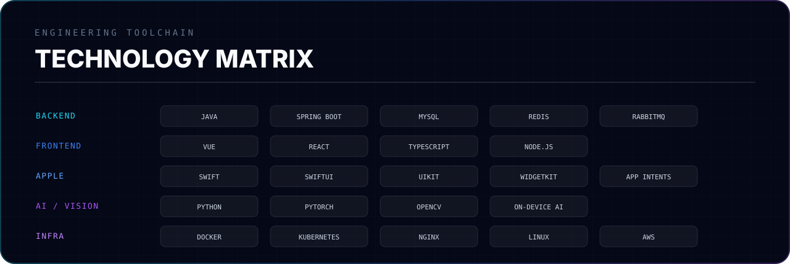

  

  
  
  

 

  

 

<h1 align="center">CONTRIBUTION SIGNAL</h1>

  

  

  

 

<h1 align="center">SELECTED SYSTEMS</h1>

  

  

 

<h1 align="center">TECHNOLOGY MATRIX</h1>

  

  

 

<h1 align="center">BUILD MODE</h1>

  
  
  
  

 

  
  

  <strong>BUILD REAL SYSTEMS · SHIP REAL PRODUCTS · SOLVE REAL PROBLEMS</strong>

