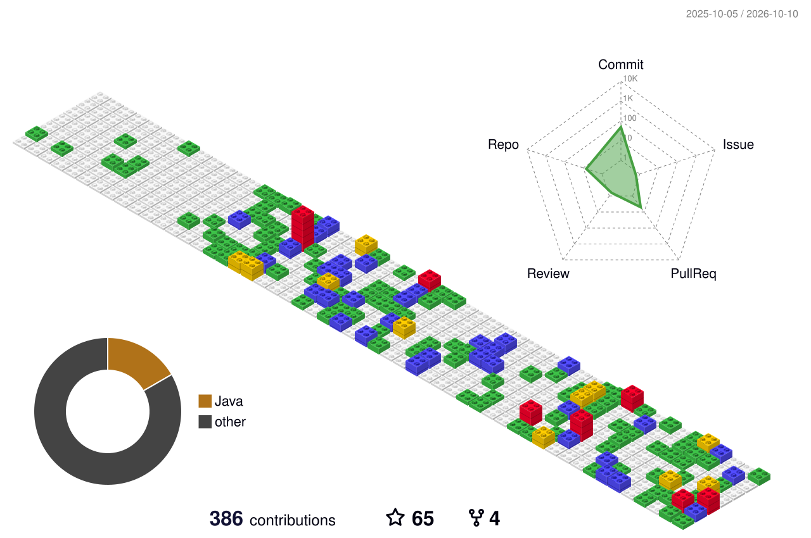

<table>
  <tr>
    <td width="66%" valign="top">
      SOFTWARE ENGINEER &nbsp;/&nbsp; INDEPENDENT BUILDER
      <h1>Lucas.</h1>
      <h3>From architecture to the last interaction.</h3>
      
I design backend systems, bring AI into real workflows, and build native Apple products. I care about how the <strong>whole thing</strong> works — not just one layer of the stack.

      

        <a href="https://github.com/change-everything?tab=repositories">Repositories ↗</a>
        &nbsp;&nbsp;·&nbsp;&nbsp;
        <a href="https://www.nexuracloud.cn">Website ↗</a>
        &nbsp;&nbsp;·&nbsp;&nbsp;
        <a href="mailto:pyptsguas@163.com">Contact ↗</a>
      

    </td>
    <td width="34%" valign="top">
      FIELDS / 2026
      
<strong>01 &nbsp; Backend systems</strong>

      
<strong>02 &nbsp; Applied AI</strong>

      
<strong>03 &nbsp; Apple platforms</strong>

      
<strong>04 &nbsp; Product engineering</strong>

    </td>
  </tr>
</table>

 

01 / WHAT SETS ME APART

## An engineer who sees the whole system.

<table>
  <tr>
    <td width="50%" valign="top">
      01 — END TO END
      <h3>Connect the layers.</h3>
      
Architecture, APIs, data, clients and deployment are parts of the same product. I can work across them and make decisions with the full picture in mind.

    </td>
    <td width="50%" valign="top">
      02 — SYSTEMS
      <h3>Engineer for what comes next.</h3>
      
My foundation is Java and Spring Boot. I focus on service boundaries, reliability, performance and keeping systems maintainable as requirements change.

    </td>
  </tr>
  <tr>
    <td width="50%" valign="top">
      03 — APPLIED AI
      <h3>Make intelligence useful.</h3>
      
With Python, PyTorch, OpenCV and AI integrations, my goal is to put capabilities into reliable workflows — not stop at a model demonstration.

    </td>
    <td width="50%" valign="top">
      04 — PRODUCT
      <h3>Own the last mile.</h3>
      
I build native iOS apps with Swift and SwiftUI, including <a href="https://snapto.site/">SnapTo</a>. Working close to the interface keeps engineering grounded in real use.

    </td>
  </tr>
</table>

 

02 / HOW I WORK

## Make the complex feel simple.

<table>
  <tr>
    <td width="33%" valign="top">
      THINK
      <h3>Systems, not snippets.</h3>
      
Understand the data flow, interfaces and trade-offs before choosing abstractions.

    </td>
    <td width="33%" valign="top">
      BUILD
      <h3>Clarity over ceremony.</h3>
      
Keep the user experience simple and put necessary complexity in the right place.

    </td>
    <td width="34%" valign="top">
      SHIP
      <h3>Reality is the test.</h3>
      
Deliver, observe how software is used, then improve what actually matters.

    </td>
  </tr>
</table>

 

03 / TOOLKIT

## Tools I reach for.

| Focus | Technologies |
|:--|:--|
| **Backend & architecture** | Java · Spring Boot · MySQL · Redis |
| **Native Apple** | Swift · SwiftUI · Vision · CloudKit |
| **AI & computer vision** | Python · PyTorch · OpenCV |
| **Web** | TypeScript · React · Vue |
| **Infrastructure** | Docker · Linux · Nginx |

 

04 / CONTRIBUTIONS

## Work in progress, every day.

  

3D contribution visualization generated from GitHub activity using <a href="https://github.com/yoshi389111/github-profile-3d-contrib">github-profile-3d-contrib</a>. Updated automatically via GitHub Actions.

---

<table>
  <tr>
    <td width="66%" valign="top">
      WHAT I'M INTERESTED IN
      <h2>Backend × AI × Product.</h2>
      
Building useful software where strong systems engineering and thoughtful product experiences meet.

    </td>
    <td width="34%" valign="middle">
      
<a href="https://snapto.site/">SnapTo ↗</a>

      
<a href="https://www.nexuracloud.cn">Website ↗</a>

      
<a href="mailto:pyptsguas@163.com">Get in touch ↗</a>

    </td>
  </tr>
</table>
