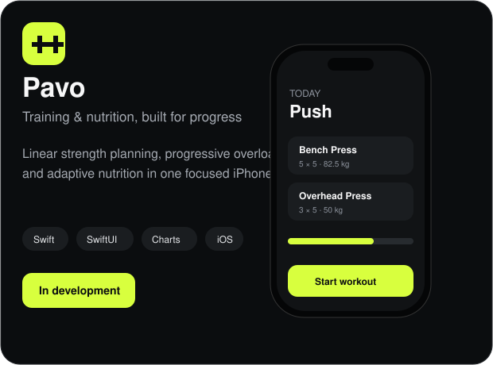

  

  <a href="https://github.com/change-everything?tab=repositories"><b>Projects</b></a>
  &nbsp;&nbsp;·&nbsp;&nbsp;
  <a href="https://www.nexuracloud.cn"><b>Website</b></a>
  &nbsp;&nbsp;·&nbsp;&nbsp;
  <a href="mailto:pyptsguas@163.com"><b>Contact</b></a>

 

## Currently Building

<table>
<tr>
<td width="50%" valign="top">
  
</td>
<td width="50%" valign="top">
  
</td>
</tr>
</table>

 

## Selected Engineering Work

 

 

## Tech Stack

<table>
<tr>
<td width="25%" valign="top">

### Backend
`Java` · `Spring Boot`  
`MySQL` · `Redis`

</td>
<td width="25%" valign="top">

### Apple
`Swift` · `SwiftUI`  
`Vision` · `CloudKit`

</td>
<td width="25%" valign="top">

### AI / Data
`Python` · `PyTorch`  
`OpenCV`

</td>
<td width="25%" valign="top">

### Infrastructure
`Docker` · `Linux`  
`Nginx`

</td>
</tr>
</table>

 

## Elsewhere

  <a href="https://github.com/change-everything">GitHub</a>
  &nbsp;&nbsp;·&nbsp;&nbsp;
  <a href="https://www.nexuracloud.cn">Website</a>
  &nbsp;&nbsp;·&nbsp;&nbsp;
  <a href="mailto:pyptsguas@163.com">Email</a>
  &nbsp;&nbsp;·&nbsp;&nbsp;
  <a href="https://snapto.site/">SnapTo</a>

Building real systems, shipping real products, solving real problems.
